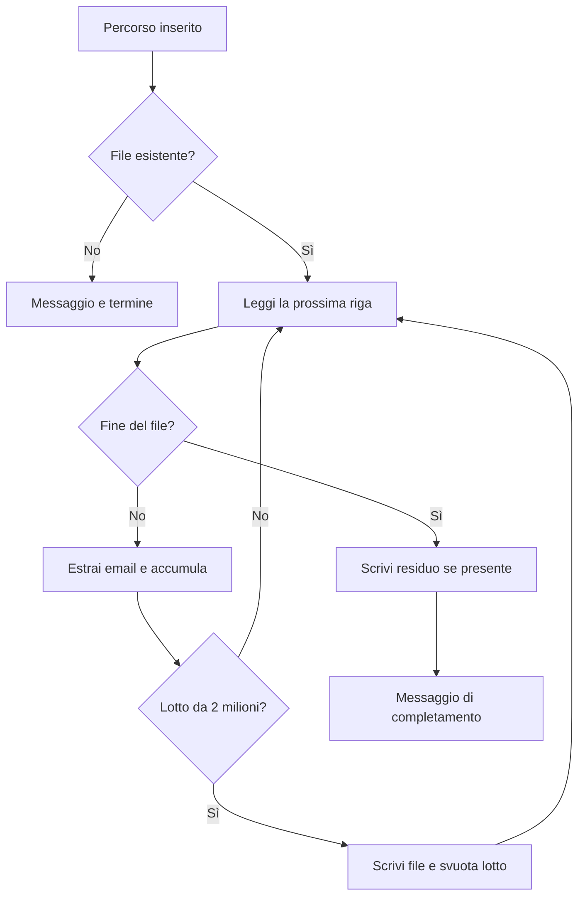

# Flussi operativi — EmailExtractor

[README](README.md) · [Codice del programma](Program.cs)

## Ambito e lettura

Documentazione ricavata dal codice disponibile il 8 ottobre 2026. Descrive il comportamento implementato, inclusi errori ed effetti sui file; non costituisce una prova di esecuzione. Qui l'utente usa una console, non una pagina web. L'elaborazione asincrona resta parte della singola esecuzione: non è un servizio schedulato.

## Flusso completo di estrazione

**Inizio:** l'utente avvia il programma da terminale.

1. La console chiede il percorso del file; l'utente lo inserisce e preme Invio. Gli argomenti di avvio non vengono usati.
2. `File.Exists` verifica il percorso. Se il file non esiste, mostra “File non trovato!” e termina senza generare output.
3. Il programma apre il file in sola lettura con `FileStream` e `StreamReader`.
4. Legge una riga alla volta con `ReadLineAsync` e cerca le corrispondenze con una regex compilata.
5. Ogni corrispondenza viene aggiunta al lotto in memoria, incrementando il contatore totale.
6. Ogni **2.000.000 di corrispondenze**, scrive il lotto in `emails_1.txt`, `emails_2.txt`, ecc. e svuota la lista.
7. Alla fine del file scrive l'eventuale lotto residuo. Se il totale è un multiplo esatto della soglia, non crea un file vuoto aggiuntivo.
8. Chiude gli stream e mostra “Estrazione completata con successo.” L'esecuzione termina.

**Risultato:** uno o più file di testo, con un indirizzo per riga, nella directory corrente del processo. Il risultato non viene scritto automaticamente nella cartella del file sorgente.

## Varianti ed errori

| Caso | Comportamento reale | Cosa fa l'utente dopo |
| --- | --- | --- |
| Nessuna email riconosciuta | Nessun file generato, ma compare il messaggio di successo | Controllare il contenuto e il formato sorgente |
| Indirizzo ripetuto | Ogni occorrenza viene conservata, nell'ordine di lettura | Deduplicare con uno strumento esterno se necessario |
| Errore di lettura o scrittura | L'eccezione viene intercettata; la console mostra il messaggio di errore | Verificare percorso e permessi, poi riavviare |
| Errore dopo aver scritto alcuni lotti | I file già prodotti restano; non c'è rollback né ripresa dal punto interrotto | Controllare gli output prima di ripetere |
| Nome output già esistente | `FileMode.Create` sovrascrive il file | Usare una directory dedicata o spostare prima gli output |

La regex riconosce stringhe compatibili con il proprio pattern: non verifica l'esistenza della casella e non invia email. Non c'è un riepilogo numerico finale né una barra di avanzamento.

## Automazioni e fine del ciclo

| Trigger | Operazione automatica | Attiva |
| --- | --- | --- |
| Lettura di ogni riga | Estrazione regex | Sì |
| Raggiungimento della soglia | Scrittura e numerazione del lotto | Sì |
| Fine input | Scrittura del residuo e rilascio delle risorse | Sì |

Dopo il messaggio finale non prosegue alcun lavoro in background. Non risultano scheduler, watcher di cartelle, notifiche, database o workflow GitHub Actions nel repository esaminato.

## Verifica manuale suggerita

Provare un file inesistente, un file senza email e un piccolo file con email ripetute. Controllare posizione e contenuto degli output, e ripetere con un output già presente per verificare la sovrascrittura. La soglia dei lotti può essere verificata con input sintetici separati dai dati reali.
