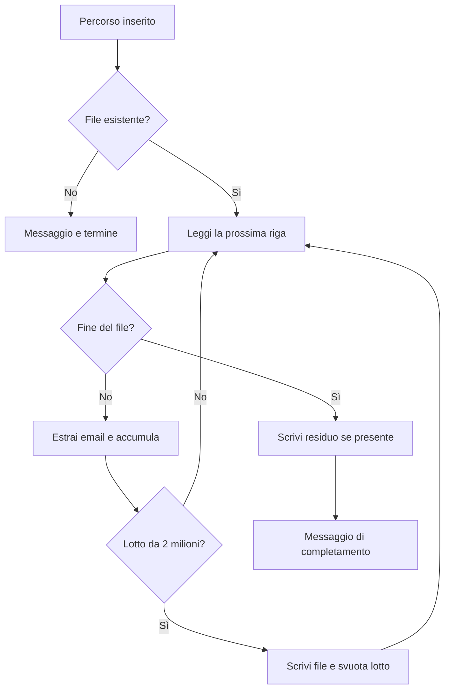

# EmailExtractor

Applicazione da terminale per estrarre indirizzi email da file di testo. Legge l'input progressivamente e produce file numerati con un indirizzo per riga, conservando ordine e occorrenze duplicate.

| Aspetto | Descrizione |
| --- | --- |
| Utilizzatore | Utente da terminale |
| Punto di ingresso | Percorso del file inserito nella console |
| Risultato | File emails_N.txt nella directory corrente |

## Indice

- [Funzionalità](#funzionalità)
- [Tecnologie e requisiti](#tecnologie-e-requisiti)
- [Configurazione](#configurazione)
- [Avvio](#avvio)
- [Flussi operativi](#flussi-operativi)
- [Esempi di utilizzo](#esempi-di-utilizzo)
- [Verifiche](#verifiche)
- [Struttura e documentazione](#struttura-e-documentazione)

## Funzionalità

- Lettura del file sorgente una riga alla volta.
- Riconoscimento degli indirizzi tramite espressione regolare.
- Scrittura in lotti da 2.000.000 di corrispondenze.
- Conservazione dell'ordine di rilevamento e dei duplicati.
- Elaborazione locale senza database o servizi di rete.

## Tecnologie e requisiti

Applicazione console C# su **.NET 8**. Sono necessari un SDK compatibile con net8.0, un file sorgente leggibile e una directory corrente scrivibile. Ogni lotto rimane in memoria fino al salvataggio.

## Configurazione

Il programma non richiede una configurazione applicativa. All'avvio legge il percorso del file da console; il percorso può essere assoluto o relativo alla directory corrente e deve essere inserito **senza virgolette**, anche se contiene spazi.

Gli output vengono scritti nella directory corrente del processo. Utilizzare una cartella dedicata se è necessario conservare risultati di esecuzioni differenti; i file con lo stesso nome vengono sovrascritti e i lotti di esecuzioni precedenti con numeri superiori possono restare presenti.

## Avvio

Dalla radice del repository:

~~~powershell
dotnet restore EmailExtractor.csproj
dotnet build EmailExtractor.csproj
dotnet run --project EmailExtractor.csproj
~~~

Quando richiesto, inserire il percorso, ad esempio:

~~~text
C:\dati-demo\testo.txt
~~~

Per avviare il programma da una directory di lavoro differente, indicare a `--project` il percorso assoluto del progetto.

## Flussi operativi

I flussi descrivono il comportamento implementato, inclusi gli effetti parziali e le automazioni non attive. La ricostruzione si basa sull'analisi statica dei sorgenti dell'8 ottobre 2026; le verifiche proposte non costituiscono test già eseguiti.

### Indice dei flussi

- [Contesto operativo](#contesto-operativo)
- [Flusso completo di estrazione](#flusso-completo-di-estrazione)
- [Varianti ed errori](#varianti-ed-errori)
- [Automazioni e fine del ciclo](#automazioni-e-fine-del-ciclo)

### Contesto operativo

L'interazione avviene tramite console. L'elaborazione asincrona resta parte della singola esecuzione: non è un servizio schedulato.

### Flusso completo di estrazione

**Punto di ingresso:** l'utente avvia il programma da terminale.

1. La console chiede il percorso del file; l'utente lo inserisce e preme Invio. Gli argomenti della riga di comando non vengono utilizzati.
2. `File.Exists` verifica il percorso. Se il file non esiste, mostra “File non trovato!” e termina senza generare output.
3. Il programma apre il file in sola lettura con `FileStream` e `StreamReader`.
4. Legge una riga alla volta con `ReadLineAsync` e cerca le corrispondenze con una regex compilata.
5. Ogni corrispondenza viene aggiunta al lotto in memoria, incrementando il contatore totale.
6. Ogni **2.000.000 di corrispondenze**, scrive il lotto in `emails_1.txt`, `emails_2.txt`, ecc. e svuota la lista.
7. Alla fine del file scrive l'eventuale lotto residuo. Se il totale è un multiplo esatto della soglia, non crea un file vuoto aggiuntivo.
8. Chiude gli stream e mostra “Estrazione completata con successo.” L'esecuzione termina.

**Risultato:** uno o più file di testo, con un indirizzo per riga, nella directory corrente del processo. Il risultato non viene scritto automaticamente nella cartella del file sorgente.

### Varianti ed errori

| Caso | Comportamento implementato | Operazioni successive |
| --- | --- | --- |
| Nessuna email riconosciuta | Nessun file generato, ma compare il messaggio di successo | Controllare il contenuto e il formato sorgente |
| Indirizzo ripetuto | Ogni occorrenza viene conservata, nell'ordine di lettura | Deduplicare con uno strumento esterno se necessario |
| Errore di lettura o scrittura | L'eccezione viene intercettata; la console mostra il messaggio di errore | Verificare percorso e permessi, poi riavviare |
| Errore dopo aver scritto alcuni lotti | I file già prodotti restano; non c'è rollback né ripresa dal punto interrotto | Controllare gli output prima di ripetere |
| Nome output già esistente | `FileMode.Create` sovrascrive il file | Usare una directory dedicata o spostare prima gli output |

La regex riconosce stringhe compatibili con il proprio pattern: non verifica l'esistenza della casella e non invia email. Non è presente un riepilogo numerico finale né una barra di avanzamento.

### Automazioni e fine del ciclo

| Trigger | Operazione automatica | Attiva |
| --- | --- | --- |
| Lettura di ogni riga | Estrazione regex | Sì |
| Raggiungimento della soglia | Scrittura e numerazione del lotto | Sì |
| Fine input | Scrittura del residuo e rilascio delle risorse | Sì |

Dopo il messaggio finale non prosegue alcun lavoro in background. Non risultano scheduler, watcher di cartelle, notifiche, database o workflow GitHub Actions nel repository esaminato.

## Esempi di utilizzo

Contenuto di `testo.txt`:

~~~text
Contatto principale: alice@example.com
Altro contatto: bob@example.org
Ripetizione: alice@example.com
~~~

Contenuto di `emails_1.txt`:

~~~text
alice@example.com
bob@example.org
alice@example.com
~~~

Gli indirizzi sono esempi fittizi.

## Verifiche

### Verifiche funzionali consigliate

Provare un file inesistente, un file senza email e un piccolo file con email ripetute. Controllare posizione e contenuto degli output, e ripetere con un output già presente per verificare la sovrascrittura. La soglia dei lotti può essere verificata con input sintetici separati dai dati reali.

## Struttura e documentazione

- [Program.cs](Program.cs): lettura, riconoscimento e scrittura dei lotti.
- [EmailExtractor.csproj](EmailExtractor.csproj): configurazione del progetto.
- [FLUSSI.md](FLUSSI.md): versione dedicata dei flussi riportati integralmente in questo README.
